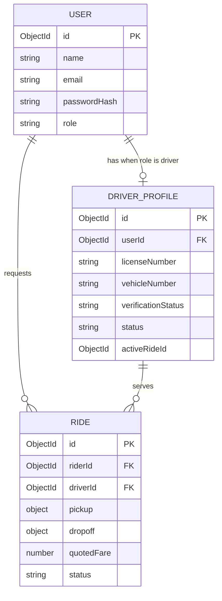

```mermaid
erDiagram
    USER {
        ObjectId id PK
        string name
        string email
        string passwordHash
        string role
    }

    DRIVER_PROFILE {
        ObjectId id PK
        ObjectId userId FK
        string licenseNumber
        string vehicleNumber
        string verificationStatus
        string status
        ObjectId activeRideId
    }

    RIDE {
        ObjectId id PK
        ObjectId riderId FK
        ObjectId driverId FK
        object pickup
        object dropoff
        number quotedFare
        string status
    }

    USER ||--o| DRIVER_PROFILE : "has when role is driver"
    USER ||--o{ RIDE : "requests"
    DRIVER_PROFILE ||--o{ RIDE : "serves"
```